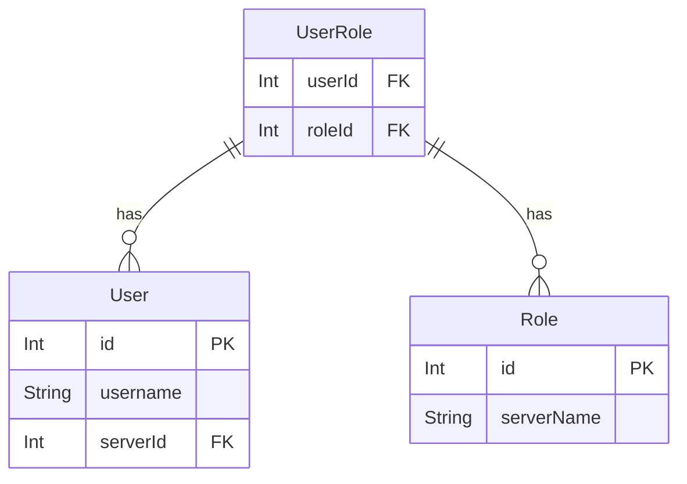

```mermaid
erDiagram
    User {
        Int id PK
        String username
        Int serverId FK
    }

    Role {
        Int id PK
        String serverName
    }

    UserRole {
        Int userId FK
        Int roleId FK
    }

    UserRole ||--o{ User : has
    UserRole ||--o{ Role : has
```
